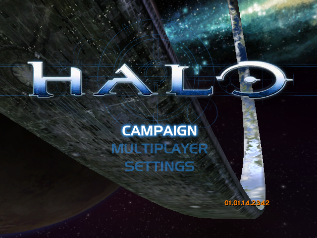

Halo CE Universal — Apple Silicon and iPhone
=============

This fork adds playable native Apple Silicon macOS and iPhone builds to
[cybersecurity/halo-ce-universal](https://github.com/cybersecurity/halo-ce-universal).
It builds on the decompilation of Halo: Combat Evolved build 2342
(`cachebeta.exe`, sha256 `4cc87b45f721270392a96f1674ed2b5cd4a7bb4355faeab4531d1cf1884d9520`).

**Start here: [Apple build setup](docs/apple-build.md)**, then follow the
[Mac instructions](port/macos/README.md#build) or
[iPhone instructions](port/ios/README.md#build).
The Apple renderer uses ANGLE's Metal backend. Mac keyboard/mouse and iPhone
touch gameplay and audio have been tested; physical iPhone gamepad play and
the full campaign still need testing.

This is a source-only repository. Supply your own original Xbox game data and
August 2001 XDK headers locally. Game images, maps, the XDK, signing identities,
provisioning profiles and built apps are not included. iPhone developers use
their own Apple development team and app identifier.

The port starts from the decompilation of [bnunu/halo-1](https://github.com/bnunu/halo-1).
That project is a fork of [punpckhdq/halo](https://github.com/punpckhdq/halo).

## Download

GitHub Actions builds the game for each commit. These links download the
builds of the latest release:

| Platform | Release | Debug |
| --- | --- | --- |
| Linux | [halo-linux-release.zip](https://github.com/cybersecurity/halo-ce-universal/releases/latest/download/halo-linux-release.zip) | [halo-linux-debug.zip](https://github.com/cybersecurity/halo-ce-universal/releases/latest/download/halo-linux-debug.zip) |
| Windows | [halo-windows-release.zip](https://github.com/cybersecurity/halo-ce-universal/releases/latest/download/halo-windows-release.zip) | [halo-windows-debug.zip](https://github.com/cybersecurity/halo-ce-universal/releases/latest/download/halo-windows-debug.zip) |
| Android | [halo-android-release.zip](https://github.com/cybersecurity/halo-ce-universal/releases/latest/download/halo-android-release.zip) | [halo-android-debug.zip](https://github.com/cybersecurity/halo-ce-universal/releases/latest/download/halo-android-debug.zip) |

For Apple platforms, use the [Apple build setup](docs/apple-build.md) and
platform guides above; their scripts configure the build automatically.
The following instructions also cover the inherited Linux, Windows, Android
and byte-matching builds.

You must source the August 2001 Xbox SDK yourself, and you need Python and [ninja-build](https://ninja-build.org/) on your PATH. Extract the `XDK/xbox` folder from the installer into the repository root such that `xbox/{bin,include}` are valid paths, then run `configure.py` from the repository root.

The game updates itself. At start-up it looks for a newer release, and asks
if you want to install it. Refer to "Updates" in
[port/linux/README.md](port/linux/README.md#updates).

Each build of the upstream `main` branch that passes on all three platforms is a new
release. The [Releases](https://github.com/cybersecurity/halo-ce-universal/releases)
page keeps the last five releases. If the latest build has a problem, get
an older build from that page. This fork keeps CI builds as artifacts;
working on its `main` does not automatically publish a release or post to Discord.

## Game data

The port does not include the game data. Download an Xbox disc image
(`.xiso` or `.iso`) of Halo: Combat Evolved. All versions of the game
operate. The maps of the European (PAL) version were made for a slower
console. The port changes them to play as the North American (NTSC) maps do,
so players of the two versions can play together.

1. Start the game.
2. At the first start, the game asks for the disc image. Select it.
3. The game extracts the `maps/` folder. Then the game starts.

On Linux and Windows, the game puts `maps/` next to the executable. On
Android, copy the disc image to the phone first. The app puts `maps/` in its
data folder. Refer to [port/android/README.md](port/android/README.md).

## Platforms

Each platform has its own instructions:

| Platform | Instructions |
| --- | --- |
| Linux (32-bit x86 executable, OpenGL 4.5, SDL3) | [port/linux/README.md](port/linux/README.md) |
| Windows (32-bit x86 executable, OpenGL 4.5, SDL3) | [port/windows/README.md](port/windows/README.md) |
| Android (arm64 app, OpenGL ES 3, SDL3) | [port/android/README.md](port/android/README.md) |

The Linux README also gives the controls, the settings and the multiplayer
functions. These are almost the same on all platforms.

## Multiplayer

The game can play system link games on a local network and on the internet:

- A system link game can have up to 128 players on up to 128 machines.
- Linux, Windows and Android machines can play in the same game.
- An invite link lets a machine join a game on the internet. No server of
  this project is necessary.
- The netcode is new. Each machine moves its own player at once,
  and the host makes the decisions for the game. Refer to
  [port/linux/NETCODE.md](port/linux/NETCODE.md).

## Build the game

You do not need the Xbox SDK. The port supplies the SDK declarations that
the game uses. Refer to [port/include/xdk](port/include/xdk/README.md).

To build the game:

1. Install Python and [ninja](https://ninja-build.org/).
2. Install the tools for your platform. Refer to the README for the
   platform.
3. In the root folder of the repository, enter `python configure.py`.
4. Enter `ninja` with the target for the platform:

### iPhone development build

The experimental iPhone port targets iOS 26+ with signed ARM game code, a
Metal-backed renderer, touch controls and gamepad support. See
[port/ios/README.md](port/ios/README.md) for the Xcode build and device signing.

### Apple Silicon macOS build

`python3 tools/macos_build.py` builds a native ARM64 Mac app using ANGLE's Metal
backend. Campaign gameplay, mouse capture, and audio have been confirmed on an
M5 Mac. See [port/macos/README.md](port/macos/README.md) for dependency setup,
launch instructions, validation limits, and the next performance phase.

### Android build

If you enter `ninja` without a target, ninja builds the game for the
computer that you use.

`tools/ci_build.py` makes the same builds as GitHub Actions. For example,
enter `python tools/ci_build.py linux release`.

### Build options

Give these options to `configure.py`:

| Option | Result |
| --- | --- |
| (none) | A debug build. A failed assertion stops the game. |
| `--release` | A release build. The game does not examine assertions, as in the retail game. |
| `--portable` | The Linux and Windows builds operate on all x86-64 processors. Use this option for builds that you give to other persons. |
| `--lto=thin`, `--lto=off` | Less link-time optimization. The link is faster. |
| `--pgo=off` | No profile-guided optimization. |
| `--pgo=train` | Records a new optimization profile. Refer to "Optimization profiles". |

Without `--portable`, the Linux and Windows builds use all the instructions
of the processor that builds them (`-march=native`). Such a build does not
always start on a different computer.

### Optimization profiles

The builds use profiles of the game to optimize the code:

- `pgo/halo_linux.profdata` for Linux and Android.
- `pgo/halo_windows.profdata` for Windows.

The profiles need clang 22 or later. With an older clang, the builds do not
use the profiles.

To record a new profile:

1. Delete the profile.
2. Enter `python configure.py --pgo=train`.
3. Enter `ninja linux` or `ninja windows`.

The build then plays the main menu and the first minute of each campaign
level. This procedure continues for approximately 15 minutes. The game
data must be in `assets/`.
